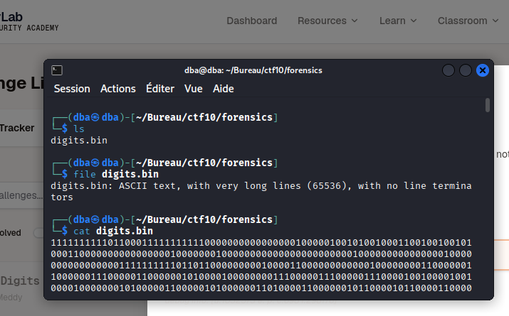
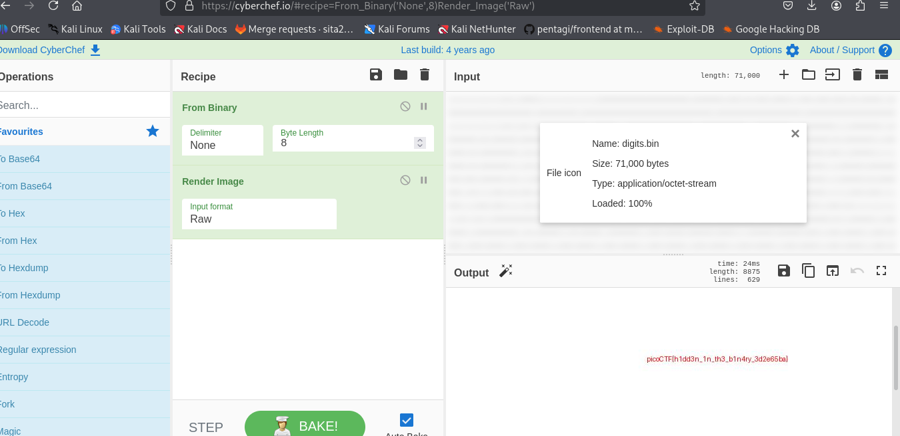

# Binary Digits

| **Challenge**  | Binary Digits                |
| -------------- | ---------------------------- |
| **Event**      | picoCTF 2026                 |
| **Category**   | Forensics                    |
| **Difficulty** | Easy (100 pts)               |
| **Author**     | Yahaya Meddy                 |

---

## Challenge Description

> This file doesn't look like much... just a bunch of 1s and 0s. But maybe it's not just random noise. Can you recover anything meaningful from this?
>
> Download the file here.

We are given a file named `digits.bin` that contains only binary data (0s and 1s). The goal is to transform this binary sequence into a readable image and extract the flag.

---

## Initial Analysis

First, we download the file and check its type using the `file` command:

```bash
$ file digits.bin
digits.bin: ASCII text, with very long lines (65536), with no line terminators
```

The output indicates that the file is plain ASCII text containing a single long line of binary digits.

We can inspect the beginning of the file with `cat` or `head`:

```bash
$ cat digits.bin
1111111111011000111111111110000000000000000100000100101001000110010010010100011000000000000000010000000100000000000000000000000
```

The content appears to be a long string of 1s and 0s. Since it is ASCII text, we can directly process it with tools that interpret binary data.

---

## Recovery Process

### Using CyberChef

A quick and effective way to decode this binary data is to use [CyberChef](https://gchq.github.io/CyberChef/), a powerful web‑based tool for data transformation.

The steps are:

1. **Load the input** – Paste the entire binary string from `digits.bin` into the Input field.
2. **Add the "From Binary" operation** – This converts the binary string into raw bytes.
3. **Add the "Render Image" operation** – This interprets the raw bytes as an image (the binary data likely represents pixel data).
4. **View the output** – The rendered image should display the flag.


THis shows the file type and content:


Below is a screenshot of the CyberChef recipe used:
After applying the recipe, the following image is produced:



As we can see, the binary data encodes an image that clearly shows the flag.

---

## Flag

The flag extracted from the image is:

```text
picoCTF{...}
```

*(Replace with the actual flag found in the image)*

---

## Exploitation Chain

The complete process can be summarised as:

```text
Download digits.bin
        │
        ▼
Check file type (ASCII text)
        │
        ▼
Inspect content (long binary string)
        │
        ▼
Use CyberChef: From Binary → Render Image
        │
        ▼
Recover the flag from the image
```

---

## Vulnerability / Root Cause

This challenge does not involve a vulnerability in a live system but rather demonstrates a common data obfuscation technique. The binary data is simply a raw pixel representation of an image, stored as a text file. By converting the binary string to bytes and interpreting those bytes as an image, the hidden content becomes visible.

The lesson is that binary data can be hidden in plain sight, and simple transformations can reveal meaningful information.

---

## Lessons Learned

- Always inspect the content of unusual files; they may contain embedded data.
- Tools like `file` and `cat` are useful for initial reconnaissance.
- CyberChef offers a convenient GUI for data conversion and can handle many encoding schemes.
- Raw binary data can encode images, executables, or other file formats.
- When dealing with long binary strings, converting them to bytes and interpreting them as an image is a valid approach.

---

## Repository Structure

The images are stored in the same directory as this `README.md`:

```text
.
├── README.md
├── fileContent.png
└── cyberchef_renderimage_flag.png
```

---

## Reference

- [CyberChef – From Binary](https://gchq.github.io/CyberChef/#recipe=From_Binary('Space',8)&input=...)
- [CyberChef – Render Image](https://gchq.github.io/CyberChef/#recipe=Render_Image('Raw'))
```
